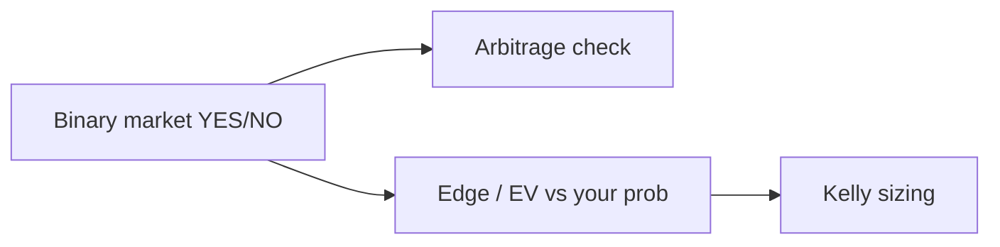

<p align="center">
  
</p>

<h1 align="center">Polymarket Trading Bot</h1>

<p align="center">
  <strong>Polymarket prediction-market trading bot — edge, YES/NO arbitrage, and Kelly sizing in Python.</strong><br>
  Find +EV bets and risk-free arbitrage on binary outcome markets.
</p>

<p align="center">
  <em>Built and maintained by <a href="https://viprasol.com">Viprasol Tech</a> — Fintech Experts. Full-Stack Builders.</em>
</p>

<p align="center">
  <a href="https://github.com/Viprasol-Tech/polymarket-trading-bot/actions/workflows/ci.yml"></a>
  <a href="LICENSE"></a>
  
  <a href="https://t.me/viprasol_help"></a>
  <a href="https://github.com/Viprasol-Tech/polymarket-trading-bot/stargazers"></a>
</p>

---

> ## ⚠️ Disclaimer
> This software is for **educational purposes only** and is **not financial, betting, or investment advice**. Prediction-market and on-chain trading involves substantial risk, including the **total loss of capital**. Ensure prediction markets are **legal in your jurisdiction** and that you comply with Polymarket's terms. **Use at your own risk** — Viprasol Tech assumes no responsibility for your results.

---

## ✨ Features

- 🎯 **Edge / expected value** — quantify a bet from your probability estimate vs. the market price.
- 🔒 **YES/NO arbitrage** — detect risk-free profit when YES + NO < 1.
- 📐 **Kelly sizing** — full and fractional Kelly for binary bets, with a min-edge gate and caps.
- ✅ **Verifiable math** — tests assert EV, Kelly, and arbitrage identities.
- 🖥️ **CLI** — `polymarket-trading-bot edge` and `polymarket-trading-bot arb`.
- ⚙️ **Modern tooling** — ruff, mypy (strict), pytest, GitHub Actions CI.

## 🚀 Quickstart

```bash
git clone https://github.com/Viprasol-Tech/polymarket-trading-bot.git
cd polymarket-trading-bot
python -m pip install -e ".[dev]"

# You think YES is 60% likely, market sells it at 0.50:
polymarket-trading-bot edge --true-prob 0.60 --price 0.50 --bankroll 1000

# Check a YES/NO arbitrage:
polymarket-trading-bot arb --yes 0.48 --no 0.49
```

## 🧩 In code

```python
from polymarket_trading_bot.edge import expected_value, stake_fraction
from polymarket_trading_bot.market import BinaryMarket, detect_arbitrage

ev = expected_value(true_prob=0.60, price=0.50)          # +0.20
frac = stake_fraction(true_prob=0.60, price=0.50)        # fractional-Kelly stake
arb = detect_arbitrage(BinaryMarket("Q?", 0.48, 0.49))   # risk-free profit per pair
```

## 🏗️ Architecture



## 🗺️ Roadmap

- [x] Edge / EV + YES/NO arbitrage + Kelly sizing
- [ ] Polymarket CLOB API client (live prices)
- [ ] Multi-market scanner and ranking
- [ ] Cross-venue arbitrage (vs Kalshi)

## 🤝 Contributing

PRs welcome — see [CONTRIBUTING.md](CONTRIBUTING.md) and our [Code of Conduct](CODE_OF_CONDUCT.md).

## 📬 Contact — Viprasol Tech Private Limited

- 🌐 Website: [viprasol.com](https://viprasol.com)
- ✉️ Email: [support@viprasol.com](mailto:support@viprasol.com)
- 💬 Telegram: [t.me/viprasol_help](https://t.me/viprasol_help) · 📱 WhatsApp: +91 96336 52112
- 🐙 GitHub: [@Viprasol-Tech](https://github.com/Viprasol-Tech) · 💼 [LinkedIn](https://www.linkedin.com/in/viprasol/) · 𝕏 [@viprasol](https://twitter.com/viprasol)

> *Viprasol Tech — fintech software, algorithmic trading systems, MT4/MT5 bots, AI voice agents, and B2B SaaS. Need a custom build? [Get in touch](mailto:support@viprasol.com).*

## 📄 License

[MIT](LICENSE) © 2025 Viprasol Tech Private Limited
