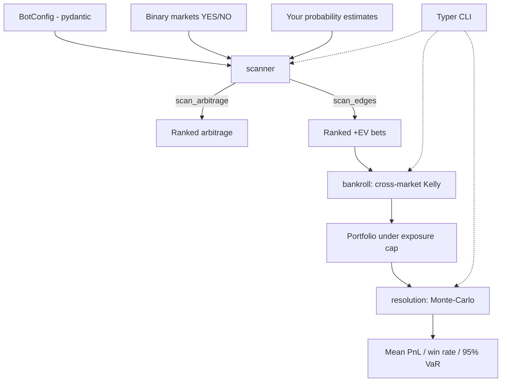

<p align="center">
  
</p>

<h1 align="center">Polymarket Trading Bot</h1>

<p align="center">
  <strong>Edge, arbitrage, cross-market Kelly sizing, and a resolution simulator for binary prediction markets.</strong><br>
  Find +EV bets and risk-free arbitrage on Polymarket-style YES/NO markets — with the risk math done for you.
</p>

<p align="center">
  <em>Built and maintained by <a href="https://viprasol.com">Viprasol Tech</a> — Fintech Experts. Full-Stack Builders.</em>
</p>

<p align="center">
  <a href="https://github.com/Viprasol-Tech/polymarket-trading-bot/actions/workflows/ci.yml"></a>
  <a href="LICENSE"></a>
  
  
  
  
  <a href="https://t.me/viprasol_help"></a>
  <a href="https://github.com/Viprasol-Tech/polymarket-trading-bot/stargazers"></a>
</p>

---

> ## ⚠️ Disclaimer
> This software is for **educational and research purposes only** and is **not financial, betting, or investment advice**. Prediction-market and on-chain trading involves substantial risk, including the **total loss of capital**. The sample data shipped with this project is illustrative and **not live market data**. Ensure prediction markets are **legal in your jurisdiction** and that you comply with Polymarket's terms of service. Nothing here executes real trades. **Use at your own risk** — Viprasol Tech assumes no responsibility for your results.

---

## ✨ Features

- 🎯 **Edge / expected value** — quantify any bet from your probability estimate vs. the market price, with probability edge and expected log-growth.
- 🔒 **Fee-aware arbitrage** — detect risk-free profit when YES + NO < 1, accounting for taker fees, and size it to your capital.
- 📊 **Multi-market scanner** — rank arbitrage and +EV directional opportunities across a whole basket, best first.
- 💰 **Cross-market Kelly bankroll** — fractional-Kelly stakes per market, trimmed proportionally to respect a total-exposure cap.
- 🎲 **Resolution simulator** — seeded Monte-Carlo over outcomes giving mean/median PnL, win rate, volatility, and 95% value-at-risk.
- 🧮 **De-vigging** — strip the bookmaker overround for a fair-probability estimate.
- ⚙️ **Typed config** — a validated, frozen pydantic `BotConfig` for every knob.
- 🖥️ **Rich CLI** — `edge`, `arb`, `arb-scan`, `scan`, `allocate`, `simulate`.
- ✅ **Verifiable math** — 52 tests assert EV, Kelly, growth, arbitrage and portfolio identities.
- 🛠️ **Modern tooling** — ruff, mypy (strict), pytest, GitHub Actions CI.

## 🚀 Quickstart

```bash
git clone https://github.com/Viprasol-Tech/polymarket-trading-bot.git
cd polymarket-trading-bot
python -m pip install -e ".[dev]"

# Full edge report for a single YES bet (you think 60%, market sells at 0.50):
polymarket-trading-bot edge --true-prob 0.60 --price 0.50 --bankroll 1000

# Rank +EV bets across the built-in sample basket:
polymarket-trading-bot scan

# Find risk-free arbitrage across the basket:
polymarket-trading-bot arb-scan

# Size a Kelly portfolio under an exposure cap, then stress-test it:
polymarket-trading-bot allocate --bankroll 1000
polymarket-trading-bot simulate --trials 10000 --seed 42
```

## 🧩 In code

```python
from polymarket_trading_bot.config import BotConfig
from polymarket_trading_bot.edge import SizingConfig, analyze_edge
from polymarket_trading_bot.market import BinaryMarket, detect_arbitrage
from polymarket_trading_bot.scanner import scan_arbitrage, scan_edges
from polymarket_trading_bot.bankroll import allocate
from polymarket_trading_bot.resolution import positions_from_allocations, simulate

# Single-bet diagnostics.
report = analyze_edge(true_prob=0.60, price=0.50)
print(report.expected_value, report.full_kelly, report.growth_rate)  # +0.20 ...

# Fee-aware arbitrage on one market.
arb = detect_arbitrage(BinaryMarket("Q?", 0.48, 0.49, fee=0.01))
print(arb.exists, arb.profit_on(1000.0))

# Scan a basket, size a portfolio, then Monte-Carlo the resolution.
markets = [
    BinaryMarket("Will Team A win?", 0.62, 0.40, slug="team-a"),
    BinaryMarket("Will it rain?", 0.48, 0.49, slug="rain"),
]
beliefs = {"team-a": 0.72, "rain": 0.50}
opps = scan_edges(markets, beliefs, SizingConfig(kelly_fraction=0.5))
portfolio = allocate(opps, bankroll=1_000.0, config=BotConfig())

prices = {m.slug: m.yes_price for m in markets}
positions = positions_from_allocations(portfolio.allocations, prices, beliefs)
result = simulate(positions, trials=10_000, seed=42)
print(result.mean_pnl, result.win_rate, result.value_at_risk_95)
```

A runnable end-to-end walkthrough lives in [`examples/portfolio_demo.py`](examples/portfolio_demo.py).

## 🏗️ Architecture



## 📚 Module / API map

| Module | Key API | What it does |
| --- | --- | --- |
| `market` | `BinaryMarket`, `detect_arbitrage`, `ArbResult` | YES/NO model, fee-aware arbitrage, vig & de-vigging |
| `edge` | `analyze_edge`, `expected_value`, `kelly_fraction`, `growth_rate` | EV, probability edge, Kelly, expected log-growth |
| `config` | `BotConfig` | Validated, frozen pydantic settings |
| `scanner` | `scan_arbitrage`, `scan_edges` | Rank arbitrage & +EV bets across a basket |
| `bankroll` | `allocate`, `Portfolio`, `Allocation` | Cross-market Kelly sizing under a total cap |
| `resolution` | `simulate`, `Position`, `SimulationResult` | Seeded Monte-Carlo of basket outcomes |
| `cli` | `edge`, `arb`, `arb-scan`, `scan`, `allocate`, `simulate` | Rich terminal interface |

## 🗺️ Roadmap

- [x] Edge / EV + YES/NO arbitrage + Kelly sizing
- [x] Richer edge analytics (probability edge, expected log-growth)
- [x] Multi-market scanner and ranking
- [x] Cross-market Kelly bankroll management with an exposure cap
- [x] Monte-Carlo resolution simulator (mean PnL, win rate, VaR)
- [x] CLI subcommands (`scan`, `allocate`, `simulate`, `arb-scan`)
- [ ] Polymarket CLOB API client (live prices & order books)
- [ ] Cross-venue arbitrage (vs Kalshi)
- [ ] Correlated-market simulation (joint outcome distributions)

## ❓ FAQ

**Does this place real trades?**
No. It is a research and risk-modelling toolkit. There is no exchange connectivity and no order execution.

**Is the sample data real Polymarket data?**
No. `sample_data.py` ships hand-crafted, illustrative numbers so the CLI and tests run offline and deterministically.

**Why fractional Kelly?**
Full Kelly maximises long-run growth but is volatile and assumes your probability estimates are exact. Half-Kelly (the default) keeps most of the growth with far less drawdown — and across many markets the bankroll module trims the basket to a total-exposure cap.

**What does the 95% VaR mean here?**
The 5th-percentile PnL across simulated resolutions: in 95% of simulated worlds you do at least this well (the value is negative when it represents a loss).

## 🤝 Contributing

PRs welcome — see [CONTRIBUTING.md](CONTRIBUTING.md) and our [Code of Conduct](CODE_OF_CONDUCT.md). Please run `ruff check .`, `mypy src`, and `pytest` before opening a PR.

## Contact — Viprasol Tech Private Limited

- Website: [viprasol.com](https://viprasol.com)
- Email: [support@viprasol.com](mailto:support@viprasol.com)
- Telegram: [t.me/viprasol_help](https://t.me/viprasol_help) | WhatsApp: +91 96336 52112
- GitHub: [@Viprasol-Tech](https://github.com/Viprasol-Tech) | [LinkedIn](https://www.linkedin.com/in/viprasol/) | X [@viprasol](https://twitter.com/viprasol)

## License

[MIT](LICENSE) (c) 2025 Viprasol Tech Private Limited
